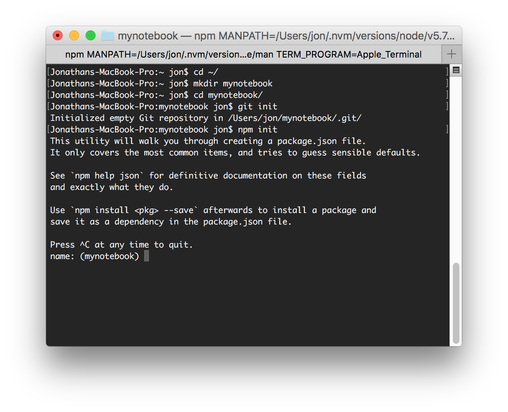
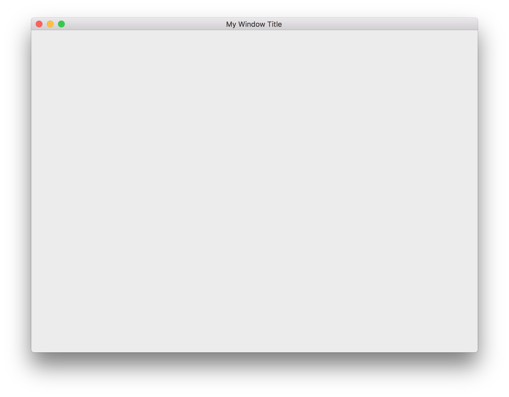
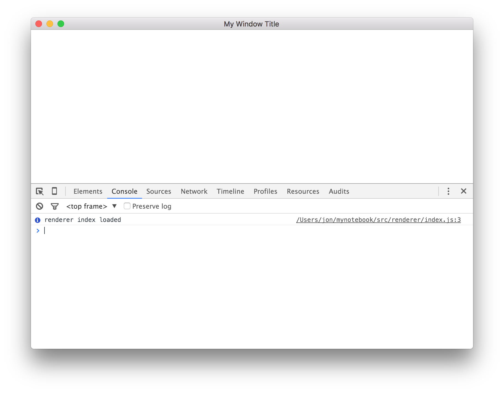

# Writing Your Own Notebook with Remote Compute

Interactive data exploration is essential for data science, quantitative finance,
physics, and many other high tech markets.  An increasingly popular way to
**interact** with data is is to use a notebook that mixes narrative content with
programming code. There are many notebook implementations available today.
Before you decide to write your own notebook-like application, you should
investigate the existing implementations.  There's a good chance that an
implementation already exists which meets your needs or that modifying an existing
implementation will also suffice.  For a list of existing notebook implementations,
see [Appendix A](#appendixA).  

This tutorial describes how to write an Electron based interactive notebook
application.  It's closely modeled after the ideas used in the nteract notebook.
nteract technologies will be used to simplify the implementation.

### Requirements

Before continuing, the following software is required:

- [Node 4.x or 5.x](https://nodejs.org/en/download/)
- npm 3.x (should be included in the node installer)
- [git 2.x](https://git-scm.com/)

To check if you have these installed run

```bash
node -v
npm -v
git --version
```

This tutorial was developed both on Linux and OSX computers.  Optionally, you can
install the [atom editor](https://atom.io/) which is the text editor used in
this tutorial.

### Prepare project

First, open up your terminal and create and navigate into a directory for the
your new project's source code.  Here I create one in my home directory.

```bash
cd ~/
mkdir mynotebook
cd mynotebook
```

Now initialize the directory as a git project.

```bash
git init
```

Next initialize the directory as an npm package.  You can do this using the
wizard included with npm.

```bash
npm init
```

You should see the following



If you want, you can enter information about your project, like its name and
description as the wizard prompts for that info.  Otherwise you can accept all
of the defaults by hitting return multiple times until the wizard exits.  You
can change these settings later by editing the `package.json` file that the
wizard will create for you.

### Get electron working

The next step is to setup the project as an
[electron app](http://electron.atom.io/).  Electron is a stripped down version
of Chrome that allows you to build desktop applications using web technologies.
First electron must be installed

```bash
npm install electron-prebuilt@^0.36.2 --save
```

"Wait, this command looks cryptic!  What's going on here?"
`npm i` is shorthand for `npm install`.  `npm i` will be used throughout the
rest of the tutorial to save characters.  `electron-prebuilt` is the name of the
[npm package](https://www.npmjs.com/package/electron-prebuilt) that contains the
electron interpreter.  The `@^0.36.2` tells npm to install the major revision
that this tutorial uses.  Lastly `--save` tells npm to install the package
as a runtime dependency so that it gets installed automatically along with your
package.

The electron-prebuilt package will be installed to a specially named folder in
the project's root directory called `node_modules`.  This folder should not be
checked into git, so it should be added to the `.gitignore` file.

```bash
echo "node_modules/" >> .gitignore
```

Because modern web technology is awesome, we'll opt in to using Javascript ES6
instead of ES5.  To do so, install electron-compile

```bash
npm install electron-compile@^2.0.4 --save
```

And then install the required electron-compilers package as a dev dependency,
which means it will only be installed with development installs

```bash
npm install electron-compilers@^2.0.4 --save-dev
```

Electron compile will automatically
[transpile](https://www.google.com/webhp?sourceid=chrome-instant&ion=1&espv=2&ie=UTF-8#q=define%3A%20transpile)
the ES6 Javascript we use into
ES5 Javascript.

Electron-compile only gets us a part of the way there.  It's the mechanism
that triggers the transpilation, but it's not actually smart enought to do the
translation itself.  Instead it relies on other packages, like Babel, to do that.
We will use [Babel](https://babeljs.io/) to perform the translation.  Babel is
composed of many smaller packages.  Here we will install a subset of those packages:

```bash
npm install babel-core@^6.7.4 babel-plugin-transform-class-properties@^6.6.0 babel-plugin-transform-object-rest-spread@^6.6.5 babel-preset-es2015@^6.6.0 babel-preset-react@^6.5.0 --save-dev
```

Lastly we need to configure babel using a `.babelrc` file.

```bash
touch .babelrc
```

Edit the babelrc (`atom .babelrc`) so it looks like this

```json
{
  "presets": [
    "es2015",
    "react"
  ],
  "plugins": [
    "transform-class-properties",
    "transform-object-rest-spread"
  ]
}
```

This babelrc file tells babel to translate
[es2015](https://babeljs.io/docs/plugins/preset-es2015/)
and [react](https://babeljs.io/docs/plugins/preset-react/)
code into es5 code.  es2015 is ES6, ratified into Javascript in 2015.  To learn
more about it, see [this page](https://babeljs.io/docs/learn-es2015/).  The
object rest spread plugin is a stage 2 (draft) spec of Javascript, read more
about it [here](http://babeljs.io/docs/plugins/transform-object-rest-spread/).
The class properties plugin is a stage 1 (proposal) spec of Javascript, read
more about it [here](http://babeljs.io/docs/plugins/transform-class-properties/).

A typical electron application has two or more processes at any given time.
One of these processes is the "main" process, which is responsible for spawning
windows.  The other processes are "renderer" processes, which are responsible
for rendering content inside each window.  There is one renderer process per
window.

The thread structure will be reflected in the folder structure of the project.
In npm projects it is common practice to put all uncompiled code inside a source
directory called `src`.  We will create two subdirectories, one for each thread
type, and `index.js` files for each of the directories.  `index.js` is a common
name used for an entry point file within npm projects.  Additionally we will
create an index.html file which will be the entry point file for the spawned
renderer windows.  This html file will load the renderer index.js file.

```bash
touch index.js
mkdir src/
cd src/
mkdir main/
mkdir renderer/
touch main/index.js
touch renderer/index.js
touch renderer/index.html
cd ..
```

Now, open the project's root directory for editing in your favorite text editor.

```bash
atom .
```

The next step is to setup the execution script.  Before we do so, it's useful to
review how npm package scripts work.  Open the `./package.json` file.  It should
look something like this:

```json
{
  "name": "mynotebook",
  "version": "1.0.0",
  "description": "",
  "main": "index.js",
  "scripts": {
    "test": "echo \"Error: no test specified\" && exit 1"
  },
  "author": "",
  "license": "ISC",
  "dependencies": {
    "electron-compile": "^2.1.4",
    "electron-prebuilt": "^0.36.12"
  }
}
```

The `scripts` section of the package.json file describes what scripts your
package provides.  Scripts can be run from the terminal via `npm run`.  For
example, to run the `test` script specified in the package.json above, one
would execute `npm run test` in the terminal.

The script names may also have syntactical meaning.  Scripts with a name
prefixed with a `pre` get executed before the named script is invoked.  
Likewise, names prefixed with `post` get executed after.  To illustrate this,
imagine the following scripts existing in a package.json

```json
{
  "scripts": {
    "task": "echo \"a\"",
    "pretask": "echo \"b\"",
    "posttask": "echo \"c\"",
    "other": "echo \"d\"",
    "preother": "echo \"e\"",
    "postother": "echo \"f\"",
  },
}
```

Executing `npm run task` would result in the following output

```bash
b
a
c
```

Scripts can also call other scripts by calling `npm run`.


```json
{
  "scripts": {
    "task": "echo \"a\"",
    "pretask": "echo \"b\" && npm run other",
    "posttask": "echo \"c\"",
    "other": "echo \"d\"",
    "preother": "echo \"e\"",
    "postother": "echo \"f\"",
  },
}
```

Here, executing `npm run task` would result in the following output

```bash
b
e
d
f
a
c
```

Lastly, it's good to know that there are special script names.  "publish",
"install", and "test" are all names that are known and called as a result of
other npm actions.  You can use "pre" and "post" prefixes to automate actions
alongside these scripts.  For example, it's common to create a "prepublish"
script which compiles the code automatically prior to an attempt to publish to
npm.

In our package.json file we will define a "start" script, which will launch
the project using the electron interpreter.


```json
{
  "name": "mynotebook",
  "version": "1.0.0",
  "description": "",
  "main": "index.js",
  "scripts": {
    "start": "electron index.js",
    "test": "echo \"Error: no test specified\" && exit 1"
  },
  "author": "",
  "license": "ISC",
  "dependencies": {
    "electron-compile": "^2.1.4",
    "electron-prebuilt": "^0.36.12"
  }
}
```

Next, edit `index.js` so that it uses electron-compile to transpile and load
the `src/main/index.js` file.

```js
// NOTE: This must remain ES5 code.
var path = require('path');
var appRoot = path.join(__dirname);
require('electron-compile').init(appRoot, './src/main');
```

Edit `src/main/index.js`, add a listener for the `ready` event of the
application.  This is what gets called when the application has loaded.  It is
here that you can spawn the window of your application.

```js
import app from 'app';

app.on('ready', () => {
  // TODO: Spawn window
});
```

To spawn a window, import `BrowserWindow` from the `browser-window` package.
Construct an instance of the BrowserWindow object, passing an options object
which describes the properties of the Window.  Here spawn a window with the
title `My Window Title`

```js
import app from 'app';
import BrowserWindow from 'browser-window';

app.on('ready', () => {
  let win = new BrowserWindow({ title: 'My Window Title' });
});
```

Now run `npm run start` from the root of your project.  You should see a blank
window appear:



Now edit the `src/renderer/index.html` so that it loads the
`src/renderer/index.js` file relatively.

```html
<!DOCTYPE html>
<html>
  <head>
    <meta charset="UTF-8">
  </head>
  <body>
    <script>
      require('./index');
    </script>
  </body>
</html>
```

Add a log statement to `src/renderer/index.js` to we know if it is loaded.

```js
console.info('renderer index loaded');
```

Finally, back in `src/main/index.js`, load the `src/renderer/index.html` file.

```js
import app from 'app';
import BrowserWindow from 'browser-window';
import path from 'path';

app.on('ready', () => {
  let win = new BrowserWindow({ title: 'My Window Title' });

  const index = path.join(__dirname, '..', 'renderer', 'index.html');
  win.loadURL(`file://${index}`);
});
```

Launch the application using `npm run start`.  Once the application starts, open
the developer console by clicking `View->Toggle Developer Tools` in the
application menu.  A Chrome developer console will appear in your application.
In the log you should see the `renderer index loaded` info statement.



Stage and commit your changes

```bash
git add -A
git commit -m "Skeleton"
```

### Understand the application and notebook models

To simplify the design of this application, the entire application state will
be cleanly separated from the rendering process by the use of MVC.  Specifically
a unidirectional data flow form of MVC will be used, called
[Flux](https://facebook.github.io/flux/docs/overview.html).  The resulting
application will more flexible in both feature and networking scalability.
Don't worry if you're unfamiliar with flux, we'll learn as we go.  However, if
you really want to grok flux, I suggest dedicating a few days to complete the
[Full-Stack Redux Tutorial by @teropa](http://teropa.info/blog/2015/09/10/full-stack-redux-tutorial.html).

On the surface, a notebook model is a linear array of "cells", where each cell
can either be a code cell or text cell.  This model works very well on disk,
where the text in the notebook file appears like it does in the application.
However, in memory, this model does not work as well.  It makes cell operations
more difficult.  Cells need to be addressed by index, therefor moving a cell
changes the address of the cell.  It's also easy to get in situations where the
cell indicies shift by one, and off by one errors are easy to come by.

The solution is to transform the disk model of a notebook, where each cell is
addressed by index, to a different in memory model where each cell has a GUID.
An array is used to specify the order of the cells by GUID.

```
cellOrder: [
  "a82j",
  "zpk2",
],
cellMap: {
  a82j: { ... },
  zpk2: { ... },
},
```

Cell operations are greatly simplified by this model.  For example, moving a
cell just involves moving it in the cellOrder array.

```diff
cellOrder: [
+  "zpk2",
  "a82j",
-  "zpk2",
],
cellMap: {
  a82j: { ... },
  zpk2: { ... },
},
```

Using this model, cell `zpk2` retains the same name as before the move
operation.  This becomes invaluable when dealing with multiple asynchronous
operations on the document at any time.

The model described here is the same model used by the
[nteract notebook](https://github.com/nteract/nteract).  It contrasts with the
index based approach used by the
[Jupyter Notebook](https://github.com/jupyter/notebook) and
[Jupyter Lab](https://github.com/jupyter/notebook).  The need for this good
abstraction is magnified by the use of immutable data structures.

### Overview of nteract technologies

The nteract organization was started as an organization for the open
exploration of interactive computing application specs, tech, and designs.
nteract is all about learning together and from each other.

That said, this tutorial will focus on the technologies used inside the
[nteract notebook](https://github.com/nteract/nteract).  Ironically, the
purpose of this tutorial is to acclimate the reader to the internals of the
nteract notebook thus encouraging upstream contributions instead of duplicate
efforts via writing a notebook from scratch.  Most of the nteract tech is well
spec'ed and implemented in small consumable packages which can be thought of as
example implementations.

The following diagram shows what roles different nteract packages play in the
design of a notebook application.


The application we are designing in this tutorial will be simplified by using
enchannel-zmq-backend to communicate directly to a Jupyter kernel (as seen below).  We'll also
make the assumption that the kernel exists on the same physical machine as the
notebook application.  This allows us to call spawnteract directly to launch
kernels.  Commutable will be used for notebook model manipulations.  Redux will
be used to store the state of the application and React will be used to render
it.  The application state will be immutable so React can make shallow
comparisons while diffing, which improves the performance.  The
react-jupyter-output-area component will be used to render outputs from the
Jupyter kernel.


### Create a state store (redux)

The first functional piece of the notebook application is the state store.  
The state store will store the entire runtime state of the application.  Storing
the entire runtime state of the application as immutable state makes undo/redo,
real time collaboration, and debugging much easier.  We will use
[Redux](http://redux.js.org/) to create a state store for the application and
[Immutable.js](https://facebook.github.io/immutable-js/) for immutable data
types.

Install immutable and redux using npm

```bash
npm install immutable@^3.7.6 redux@^3.4.0 --save
```

The state for the notebook will be stored in the renderer process.  This will
be very helpful later if you decide to add the ability to open up multiple
documents at once.  Create a state store in the index of the renderer using the
createStore redux function.

```js
console.info('renderer index loaded');

import { createStore } from 'redux';
const store = createStore(/* TODO: reducers */);
```

The Redux store manages all changes to the application state.  Changes are
invoked via "dispatched" actions.  An action is an object with a unique name and
set of parameters.  The unique name is used to identify the appropriate state
reduction which is then applied to the state.

We'll need to create a reducers function so the store can perform reductions on
the state.  Create a `src/renderers/reducers.js` file

```bash
touch src/renderer/reducers.js
```

Inside the file, export a reducers function

```js
export default function reducers(state = 0, action) {
  switch (action.type) {
    // TODO: Add actions
  case 'TEST-ACTION':
    return state;
  default:
    return state;
  }
}
```

Change the `src/renderers/index.js` file so the `createStore` function has a
handle on the reducer function

```js
console.info('renderer index loaded');

import { createStore } from 'redux';
import reducers from './reducers';
const store = createStore(reducers);
```

### Load a notebook (commutable)

Now that we have created a simple state store, let's start with the most important of notebook front-end functions — the ability to open a notebook.

Let's start by adding a menu to our application. Navigate to the main application file located at `src/main/index.js` and add the following import.

```
import { Menu } from 'electron';
```

`Menu` is an Electron object that renders a map data structure with specifications about the menu into a menu element. Let's create a new file where we will store our menu.

```
touch src/main/menu.js
```

Inside this file, we'll export a data structure that represents the file menu.

```
export const file = {
  label: '&File',
  submenu: [
    {
      open: '&Open',
      accelerator: 'CmdOrCtrl+O',
    }
  ]
};
```

This creates a "File" menu with an "Open" subitem that can be tirgged by the Cmd + O or Ctrl + O keyboard shortcuts.

Now let's go ahead and install commutable. This nteract library will allow us to execute some basic operations on notebooks, such as appending cells and updating outputs. To learn more about `commutable`, you can read [its documentation](../commutable/index.md).

At this point, we are going to take a step back and outline what it means to "open" a notebook. The steps look something like this.

1. User selects the notebook they would like to open in an Open window.
2. The JSON of the file the user selects is loaded.
3. The JSON from Step 2 is loaded into a notebook file.

Alright! Let's tackle Step 1. We'll need to load a file selector when the user selects File > Open. To do this, we are going to edit `src/main/menu/js` and attach a handler to the `click` event on the `File > Open` window.

```
import { dialog } from 'electron';

export const file = {
	label: '&File',
	submenu: [{
    	open: '&Open',
    	accelerator: 'CmdOrCtrl+O',
    	click: () => {
    		const opts = {
    			title: 'Open a notebook',
    			filters: [
    				{ name: 'Notebooks', extensions: ['ipynb'] },
    			],
    			properties: [
    				'openFile',
    			],
    			defaultPath: process.cwd(),
    		};
    		dialog.showOpenDialog(opts, (fname) => {
    			if (fname) {
    				// How do we open the file?
    			}
    		});
    	},
    }] 
};
```

Let's break down the code that we have added here. We are taking advantage of one of Electron's awesome utilities, the `dialog` module. The dialog module exposes an `showOpenDialog` function that takes care of showing the user an open dialog and limiting the types of files that they can open. In this particular case, we are limiting the user to opening only `.ipynb` files.

Once the user has selected a file, what do we do? We move on to Steps 2 and 3 of the list above. We will need a way to load the JSON from a file. To do this, let's create a new file

```
touch src/main/launch.js
```

And inside this file, we'll create a `launchFilename` function that loads a notebook from a file. Let's start by checking if a `filename` was passed and if not, we'll log a warning to
the console.

```
export function launchFilename(filename) {
	if (!filename) {
		console.warn('No filename passed!');
	}
}
```

If we do have a `filename` provided, we will need to read from the file. We'll be loading the file asychronously, so we will need to use a `Promise`.

```
return new Promise((resolve, reject) => {
	fs.readFile(filename, {}, (err, data) => {
		if (err) {
			reject(err);
		}
		resolve();
	});
});
```

Make sure that you add an import for the Node filesystem package at the top.

```
import fs from 'fs';
```

Now, what should go inside the `resolve` statement if the data is successfully read from the file? Well, for starters, we will need to parse the JSON.

```
resolve(JSON.parse(data));
```

Next, we'll need to conver this JSON into the notebook format. `commutable` comes with a `fromJS` function that converts a JSON object to a notebook model. Let's import the function from `commutable` and updated our `resolve` statement.

```
import { fromJS } from 'commutable';

...

resolve(fromJS(JSON.parse(data)));
```

What's next? We've loaded the JSON from a file selected by user into a notebook model. We'll need to load a representation of this notebook into the window. Read on, intrepid coder!


### Design notebook components (react, react-transformime)

Now that we have created a way to load a notebook, we will need to figure out a way to render notebooks. React comes to save the day!

React is a JavaScript library for building

To get started with React, we'll need to create a DOM
element on our webpage 

Install react
Create a root react node
Create a notebook node
Attach the store to the notebook node
Render some test content
create a cell node
create a text cell node
create a code cell node
install react jupyter output already
render output of code cell node

### Launch a kernel (spawnteract)

install spawnteract
read the notebook state for kernel information
launch the kernel for the notebooks

### Execute code and display results (enchannel)

create an execution reduction
on shift-enter, execute the code in the cell

### Save the notebook (commutable)

add a menu command for ctrl-s
on ctrl-s, dispatch a save action
save action call commutable, then write to disk

### Conclusion

recap
talk about possible improvements
call for action - contribute to nteract

### Appendix A <a name="appendixA"></a>
- [nteract](https://github.com/nteract/nteract)
- [Jupyter Notebook](https://github.com/jupyter/notebook)
- [Jupyter Lab](https://github.com/jupyter/notebook)
- [SageNB](http://www.sagenb.org/)
- [Beaker Notebook](http://beakernotebook.com/)
- [Apache Zeppelin](https://zeppelin.incubator.apache.org/)
